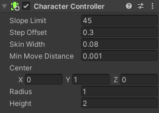

In the Inspector window for the GameObject, click ‘Add Component’ and choose **CharacterController**. Position and size the controller so it covers the whole of your patrolling GameObject.




**Tip:** Press 'shift' + 'f' to focus on the patrolling GameObject in the Scene view .

Click on 'Add Component' and add a **Box Collider**. Adjust the Center Y and Size Y values so that other characters cannot walk through or climb on top of the patrolling GameObject:


**Tip:** You will also need to add Box Colliders to the any other GameObjects that could move into the patrol area.

Click on 'Add Component' and add a ‘New script’ then give your script a sensible name.

Double-click on your new script to open it in the code editor.

Add variables to control the patrol speed and patrol area:

```
float patrolSpeed = 3.0F;
float minPosition = -4.0F;
float maxPosition = 4.0F;
```

Add code to the 'Update()' method to make the patrolling GameObject move forward until it reaches the maxPosition then turn `180` degrees and move forward again until the minPosition is reached then turn `180` degrees:

```
void Update()
    {
        CharacterController controller = GetComponent<CharacterController>();
        Vector3 forward = transform.TransformDirection(Vector3.forward);
        controller.SimpleMove(forward * patrolSpeed);

        if (transform.position.x < minPosition || transform.position.x > maxPosition)
        {
            transform.Rotate(0, 180, 0); //turn around
        }
    }
```


