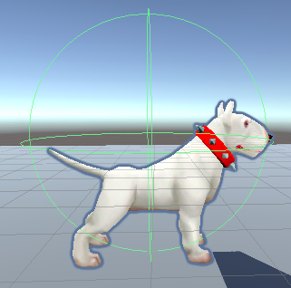

Dans la fenêtre Inspector du GameObject, clique sur **Add Component** et choisis **Character Controller**. Positionne et dimensionne le contrôleur de façon à ce qu'il couvre l'intégralité du GameObject patrouilleur.

**Astuce :** appuie sur <kbd>Shift</kbd>+<kbd>F</kbd> pour centrer la vue sur le GameObject patrouilleur dans la vue Scene.

Clique sur **Add Component** et ajoute un **Box Collider**. Règle les valeurs Centre y et Size y de façon à ce que les autres personnages ne puissent pas passer à travers ou chevaucher le GameObject patroulleur :

**Astuce :** tu devras également ajouter des Box Colliders à tous les autres GameObjects qui pourraient se déplacer dans la zone de patrouille.

Clique sur **Add Component** et ajoute un **New script**, puis donne un nom judicieux à ton script.

Double-clique sur ton nouveau script pour l'ouvrir dans l'éditeur de code.

Ajoute des variables pour contrôler la vitesse et la zone de patrouille :

--- code ---
---
language: cs
---

float patrolSpeed = 3.0f; float minPosition = -4.0f; float maxPosition = 4.0f;

--- /code ---

Ajoute du code à la méthode « Update() » pour que le GameObject patrouilleur avance jusqu'à ce qu'il atteigne la position max, puis tourne de `180` degrés et avance à nouveau jusqu'à ce que la position min soit atteinte, puis tourne de `180` degrés :

--- code ---
---
language: cs
---

    void Update()
    {
        CharacterController controller = GetComponent<CharacterController>();
        Vector3 forward = transform.TransformDirection(Vector3.forward);
        controller.SimpleMove(forward * patrolSpeed);
    
        if (transform.position.x > maxPosition)
        {
            transform.Rotate(0, 180, 0);
            transform.position = new Vector3(maxPosition, transform.position.y, transform.position.z);
        }
        else if (transform.position.x < minPosition)
        {
            transform.Rotate(0, 180, 0);
            transform.position = new Vector3(minPosition, transform.position.y, transform.position.z);
        }
    }

--- /code ---

Le fait de définir la `transform.position` après le retournement permet de s'assurer que le PNJ ne se trouve pas en dehors des limites de sa patrouille après avoir fait demi-tour.
