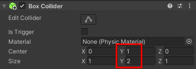

Klik in het Inspector venster voor het GameObject op **Add Component** en kies **Character Controller**. Plaats en stel de grootte in van de controller zodat deze het hele patrouillerende GameObject bedekt.

**Tip:** Druk op <kbd>Shift</kbd>+<kbd>F</kbd> om scherp te stellen op het patrouillerende GameObject in de Scèneweergave.

Klik op **Add Component** en voeg een **Box Collider**toe. Pas de waarden Center y en Size y aan zodat andere personages niet door het patrouillerende GameObject kunnen lopen of er bovenop kunnen klimmen:

**Tip:** Je moet ook Box Colliders toevoegen aan andere GameObjects die in het patrouillegebied kunnen bewegen.

Klik op **Add Component** en voeg een **New script**toe, geef vervolgens je script een logische naam.

Dubbelklik op het nieuwe script om het te openen in de code-editor.

Voeg variabelen toe om de snelheid van de patrouille en het patrouillegebied te regelen:

--- code ---
---
language: cs
---

float patrolSpeed = 3.0f;
float minPosition = -4.0f;
float maxPosition = 4.0f;

--- /code ---

Voeg code toe aan de 'Update()'-methode om het patrouillerende GameObject te laten bewegen totdat het de maxPosition bereikt, draai dan `180` graden en laat het GameObject opnieuw bewegen totdat de minPosition is bereikt, draai dan `180` graden:

--- code ---
---
language: cs
---

    void Update()
    {
        CharacterController controller = GetComponent<CharacterController>();
        Vector3 forward = transform.TransformDirection(Vector3.forward);
        controller.SimpleMove(forward * patrolSpeed);
    
        if (transform.position.x > maxPosition)
        {
            transform.Rotate(0, 180, 0);
            transform.position = new Vector3(maxPosition, transform.position.y, transform.position.z);
        }
        else if (transform.position.x < minPosition)
        {
            transform.Rotate(0, 180, 0);
            transform.position = new Vector3(minPosition, transform.position.y, transform.position.z);
        }
    }

--- /code ---

Door de `transform.position` in te stellen na het draaien, zorg je ervoor dat de NPC zich na het omdraaien niet buiten zijn patrouillegrenzen bevindt.
